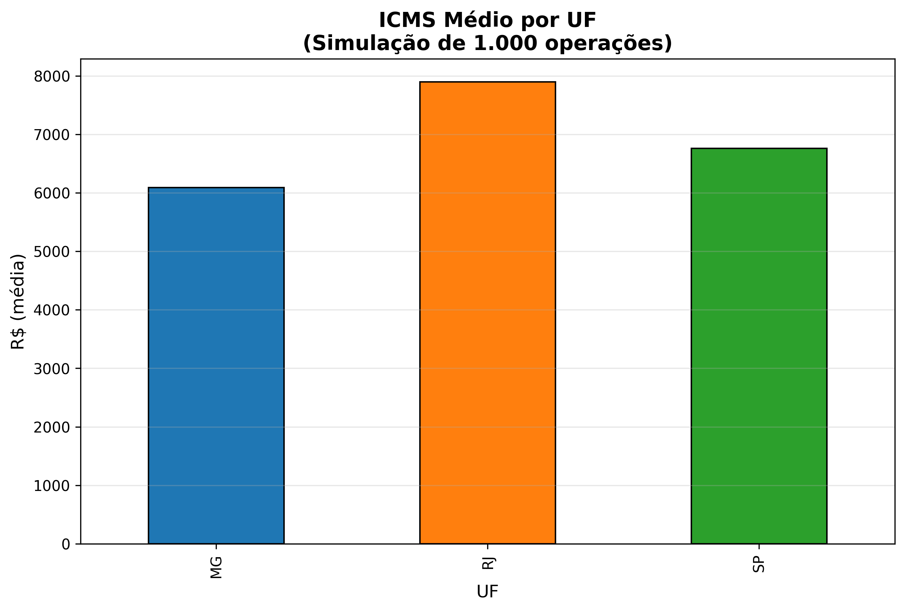

# TRIBUTEC AI  
**IA para Direito Tributário e Comércio Internacional**  
Edcarlos | Iniciado em 03/nov/2025  

  

## Semana 1 — CONCLUÍDA  
- [x] Calculadora ICMS  
- [x] Simulação de 1.000 operações  
- [x] Gráfico por UF  
- [x] Resultados em `data/resultados_icms.csv`  

  

## Estrutura do Projeto  
tributec-ai/
├── data/
│   ├── cronograma.csv      # QG do projeto
│   └── resultados_icms.csv # 1.000 simulações
├── notebooks/
│   ├── 01_calculadora_icms.ipynb # Notebook principal
│   └── grafico_icms.png    # Gráfico salvo
└── src/                    # Código fonte (futuro)

> **"O futuro do Direito Tributário é preditivo — com IA.**  
> **Karlos Neves, Advogado Tributarista com 20+ anos**

## Próximos Passos  
- Semana 2: Monte Carlo + API Bacen (risco cambial)  
- Semana 3: Álgebra Linear + PCA em jurisprudência  

[Veja o notebook completo](notebooks/01_calculadora_icms.ipynb)